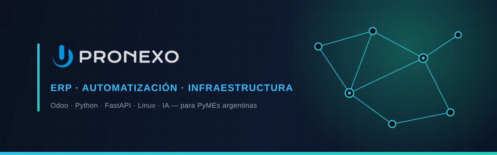

  

  
  

---

## 👋 ¡Hola! · Hi there!

**ES** — Desarrollamos e implementamos soluciones tecnológicas para **PyMEs argentinas**: ERP con **Odoo**, **automatización con IA**, desarrollo backend en **Python/FastAPI** y administración de **infraestructura y servidores**.

**EN** — We build and deploy tech solutions for **Argentine SMEs**: **Odoo** ERP, **AI automation**, backend development in **Python/FastAPI**, and **infrastructure & server** management.

---

## 🧩 Qué hacemos · What we do

| | ES | EN |
|---|---|---|
| 🏢 **Odoo / ERP** | Implementación, módulos a medida y localización argentina (ARCA/AFIP) | Implementation, custom modules & Argentine localization |
| 🐍 **Python / FastAPI** | Backends, integraciones vía XML-RPC/API y microservicios | Backends, XML-RPC/API integrations & microservices |
| 🤖 **Automatización con IA** | Asistentes de WhatsApp, agentes de IA y flujos automatizados | WhatsApp assistants, AI agents & automated workflows |
| 🖥️ **Infra / Linux / Servidores** | Administración de servidores, hosting, DNS y despliegues | Server administration, hosting, DNS & deployments |

---

## 🛠️ Stack

---

## 📊 Estadísticas · Stats

---

## 📫 Contacto · Contact

**🌐 [pronexo.com](https://pronexo.com)**

*ES — ¿Tenés una PyME y querés automatizar o implementar Odoo? Escribinos.*
*EN — Running an SME and want to automate or deploy Odoo? Get in touch.*

